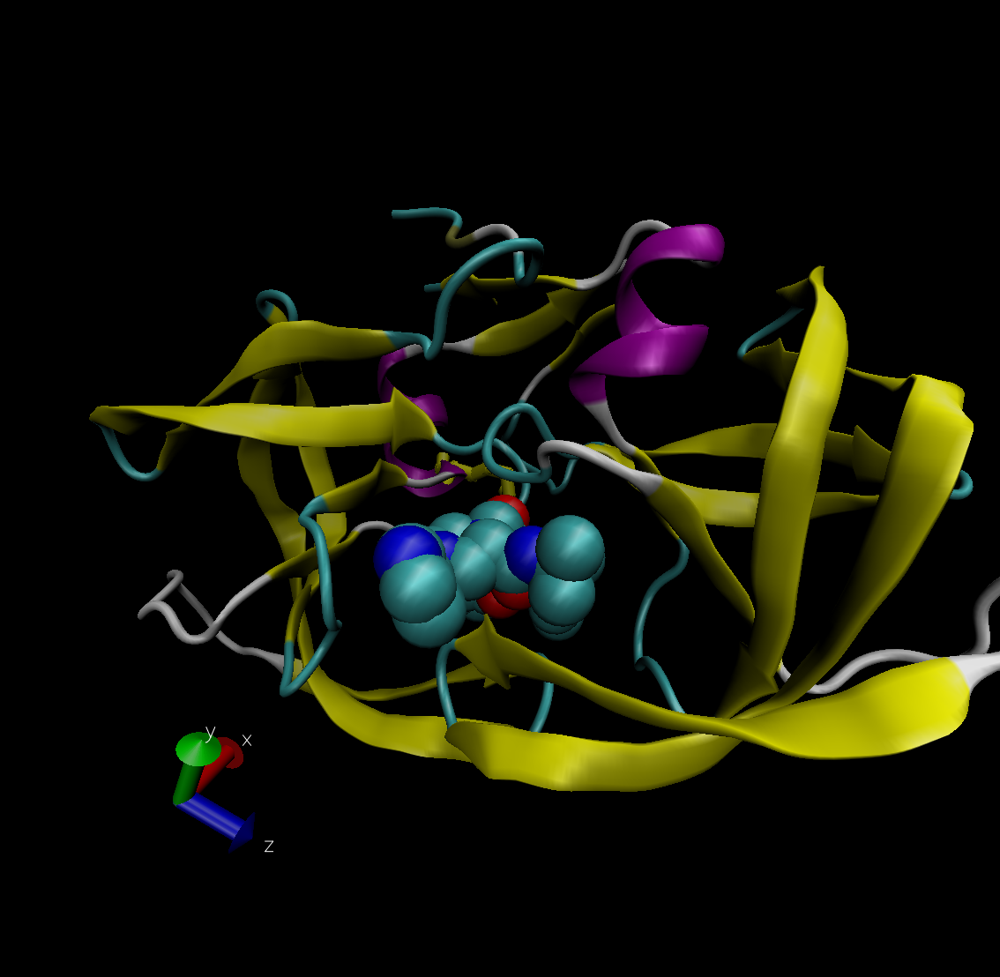

```{r}
db<-read.csv("Data Export Summary.csv", row.names=1)
View(db)

```

Q1: What percentage of structures in the PDB are solved by X-Ray and Electron Microscopy.
```{r}
#X-Ray
round(sum(db$X.ray)/sum(db$Total)*100, 2)
#EM
round(sum(db$EM)/sum(db$Total)*100, 2)

#All 
colSums(db)/sum(db$Total)
```

Q2: What proportion of structures in the PDB are protein?
```{r}
db$Total[1]/sum(db$Total)
```


Q3: Type HIV in the PDB website search box on the home page and determine how many HIV-1 protease structures are in the current PDB?


Q4: Water molecules normally have 3 atoms. Why do we see just one atom per water molecule in this structure?
Too small for the resolution of the structure. 

Q5: There is a conserved water molecule in the binding site. Can you identify this water molecule? What residue number does this water molecule have (see note below)?
ASP 25


```{r}
library(bio3d)
pdb <- read.pdb("1hsg")
pdb
```
Q7: How many amino acid residues are there in this pdb object? 
128

Q8: Name one of the two non-protein residues? 

Q9: How many protein chains are in this structure? 
2
```{r}
pdb$atom
```

```{r}
m <- nma(pdb)
plot(m)
```
```{r}
mktrj(m,file='nma.pdb')
```

