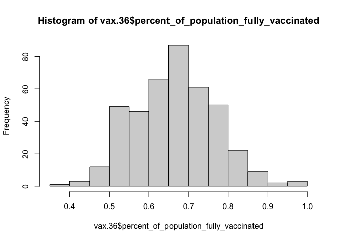
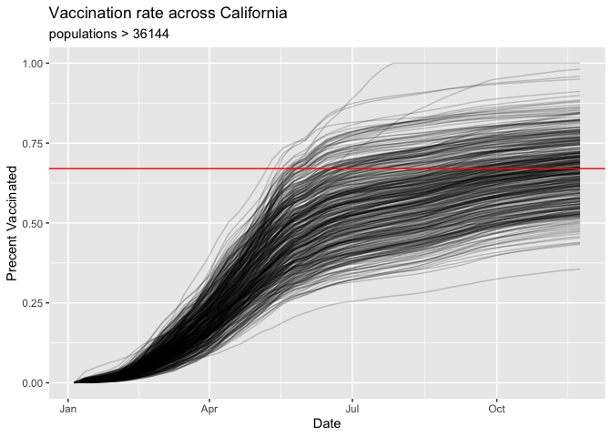

Class17
================
R(PID:A59010419
11/24/2021

Lets read in some COVID-9 Vaccine data

``` r
vax <- read.csv( 'covid19vaccinesbyzipcode_test.csv' )
head(vax)
```

    ##   as_of_date zip_code_tabulation_area local_health_jurisdiction         county
    ## 1 2021-01-05                    92395            San Bernardino San Bernardino
    ## 2 2021-01-05                    93206                      Kern           Kern
    ## 3 2021-01-05                    91006               Los Angeles    Los Angeles
    ## 4 2021-01-05                    91901                 San Diego      San Diego
    ## 5 2021-01-05                    92230                 Riverside      Riverside
    ## 6 2021-01-05                    92662                    Orange         Orange
    ##   vaccine_equity_metric_quartile                 vem_source
    ## 1                              1 Healthy Places Index Score
    ## 2                              1 Healthy Places Index Score
    ## 3                              3 Healthy Places Index Score
    ## 4                              3 Healthy Places Index Score
    ## 5                              1 Healthy Places Index Score
    ## 6                              4 Healthy Places Index Score
    ##   age12_plus_population age5_plus_population persons_fully_vaccinated
    ## 1               35915.3                40888                       NA
    ## 2                1237.5                 1521                       NA
    ## 3               28742.7                31347                       19
    ## 4               15549.8                16905                       12
    ## 5                2320.2                 2526                       NA
    ## 6                2349.5                 2397                       NA
    ##   persons_partially_vaccinated percent_of_population_fully_vaccinated
    ## 1                           NA                                     NA
    ## 2                           NA                                     NA
    ## 3                          873                               0.000606
    ## 4                          271                               0.000710
    ## 5                           NA                                     NA
    ## 6                           NA                                     NA
    ##   percent_of_population_partially_vaccinated
    ## 1                                         NA
    ## 2                                         NA
    ## 3                                   0.027850
    ## 4                                   0.016031
    ## 5                                         NA
    ## 6                                         NA
    ##   percent_of_population_with_1_plus_dose
    ## 1                                     NA
    ## 2                                     NA
    ## 3                               0.028456
    ## 4                               0.016741
    ## 5                                     NA
    ## 6                                     NA
    ##                                                                redacted
    ## 1 Information redacted in accordance with CA state privacy requirements
    ## 2 Information redacted in accordance with CA state privacy requirements
    ## 3                                                                    No
    ## 4                                                                    No
    ## 5 Information redacted in accordance with CA state privacy requirements
    ## 6 Information redacted in accordance with CA state privacy requirements

Q How many entries do we have?

``` r
nrow(vax)
```

    ## [1] 82908

Q1. What column details the total number of people fully vaccinated?
persons_fully_vaccinated Q2. What column details the Zip code tabulation
area? zip_code_tabulation_area Q3. What is the earliest date in this
dataset? 2021-01-05 Q4. What is the latest date in this dataset?
2021-11-23

``` r
skimr::skim(vax)
```

|                                                  |       |
|:-------------------------------------------------|:------|
| Name                                             | vax   |
| Number of rows                                   | 82908 |
| Number of columns                                | 14    |
| \_\_\_\_\_\_\_\_\_\_\_\_\_\_\_\_\_\_\_\_\_\_\_   |       |
| Column type frequency:                           |       |
| character                                        | 5     |
| numeric                                          | 9     |
| \_\_\_\_\_\_\_\_\_\_\_\_\_\_\_\_\_\_\_\_\_\_\_\_ |       |
| Group variables                                  | None  |

Data summary

**Variable type: character**

| skim_variable             | n_missing | complete_rate | min | max | empty | n_unique | whitespace |
|:--------------------------|----------:|--------------:|----:|----:|------:|---------:|-----------:|
| as_of_date                |         0 |             1 |  10 |  10 |     0 |       47 |          0 |
| local_health_jurisdiction |         0 |             1 |   0 |  15 |   235 |       62 |          0 |
| county                    |         0 |             1 |   0 |  15 |   235 |       59 |          0 |
| vem_source                |         0 |             1 |  15 |  26 |     0 |        3 |          0 |
| redacted                  |         0 |             1 |   2 |  69 |     0 |        2 |          0 |

**Variable type: numeric**

| skim_variable                              | n_missing | complete_rate |     mean |       sd |    p0 |      p25 |      p50 |      p75 |     p100 | hist  |
|:-------------------------------------------|----------:|--------------:|---------:|---------:|------:|---------:|---------:|---------:|---------:|:------|
| zip_code_tabulation_area                   |         0 |          1.00 | 93665.11 |  1817.39 | 90001 | 92257.75 | 93658.50 | 95380.50 |  97635.0 | ▃▅▅▇▁ |
| vaccine_equity_metric_quartile             |      4089 |          0.95 |     2.44 |     1.11 |     1 |     1.00 |     2.00 |     3.00 |      4.0 | ▇▇▁▇▇ |
| age12_plus_population                      |         0 |          1.00 | 18895.04 | 18993.94 |     0 |  1346.95 | 13685.10 | 31756.12 |  88556.7 | ▇▃▂▁▁ |
| age5_plus_population                       |         0 |          1.00 | 20875.24 | 21106.04 |     0 |  1460.50 | 15364.00 | 34877.00 | 101902.0 | ▇▃▂▁▁ |
| persons_fully_vaccinated                   |      8355 |          0.90 |  9585.35 | 11609.12 |    11 |   516.00 |  4210.00 | 16095.00 |  71219.0 | ▇▂▁▁▁ |
| persons_partially_vaccinated               |      8355 |          0.90 |  1894.87 |  2105.55 |    11 |   198.00 |  1269.00 |  2880.00 |  20159.0 | ▇▁▁▁▁ |
| percent_of_population_fully_vaccinated     |      8355 |          0.90 |     0.43 |     0.27 |     0 |     0.20 |     0.44 |     0.63 |      1.0 | ▇▆▇▆▂ |
| percent_of_population_partially_vaccinated |      8355 |          0.90 |     0.10 |     0.10 |     0 |     0.06 |     0.07 |     0.11 |      1.0 | ▇▁▁▁▁ |
| percent_of_population_with_1\_plus_dose    |      8355 |          0.90 |     0.51 |     0.26 |     0 |     0.31 |     0.53 |     0.71 |      1.0 | ▅▅▇▇▃ |

Q5. How many numeric columns are in this dataset? 9 Q6. Note that there
are “missing values” in the dataset. How many NA values there in the
persons_fully_vaccinated column? 8355 Q7. What percent of
persons_fully_vaccinated values are missing (to 2 significant figures)?
10.07 Q8. \[Optional\]: Why might this data be missing?

``` r
8355/82908 
```

    ## [1] 0.1007744

Notice some of these columns is in the date column: Lets use lubridate

``` r
library(lubridate)
```

    ## 
    ## Attaching package: 'lubridate'

    ## The following objects are masked from 'package:base':
    ## 
    ##     date, intersect, setdiff, union

``` r
today()
```

    ## [1] "2021-12-03"

How many days since the first entry in the dataset?

``` r
vax$as_of_date[1]
```

    ## [1] "2021-01-05"

``` r
d <- ymd(vax$as_of_date)
```

``` r
today()-d[1]
```

    ## Time difference of 332 days

Write over data set to have this date format

``` r
vax$as_of_date <- ymd(vax$as_of_date)
```

``` r
vax$as_of_date[nrow(vax)]
```

    ## [1] "2021-11-23"

``` r
today() - vax$as_of_date[nrow(vax)]
```

    ## Time difference of 10 days

``` r
vax$as_of_date[nrow(vax)] - vax$as_of_date[1]
```

    ## Time difference of 322 days

Last update How recently How many days does the data set span

``` r
length(unique(vax$zip_code_tabulation_area))
```

    ## [1] 1764

To work with zip codes we can use zipcoderR

``` r
library(zipcodeR)
geocode_zip('92037')
```

    ## # A tibble: 1 × 3
    ##   zipcode   lat   lng
    ##   <chr>   <dbl> <dbl>
    ## 1 92037    32.8 -117.

``` r
zip_distance('92037','92109')
```

    ##   zipcode_a zipcode_b distance
    ## 1     92037     92109     2.33

``` r
reverse_zipcode(c('92037', "92109") )
```

    ## # A tibble: 2 × 24
    ##   zipcode zipcode_type major_city post_office_city common_city_list county state
    ##   <chr>   <chr>        <chr>      <chr>                      <blob> <chr>  <chr>
    ## 1 92037   Standard     La Jolla   La Jolla, CA           <raw 20 B> San D… CA   
    ## 2 92109   Standard     San Diego  San Diego, CA          <raw 21 B> San D… CA   
    ## # … with 17 more variables: lat <dbl>, lng <dbl>, timezone <chr>,
    ## #   radius_in_miles <dbl>, area_code_list <blob>, population <int>,
    ## #   population_density <dbl>, land_area_in_sqmi <dbl>,
    ## #   water_area_in_sqmi <dbl>, housing_units <int>,
    ## #   occupied_housing_units <int>, median_home_value <int>,
    ## #   median_household_income <int>, bounds_west <dbl>, bounds_east <dbl>,
    ## #   bounds_north <dbl>, bounds_south <dbl>

Lets focus on San Deigo County

``` r
library(dplyr)
```

    ## 
    ## Attaching package: 'dplyr'

    ## The following objects are masked from 'package:stats':
    ## 
    ##     filter, lag

    ## The following objects are masked from 'package:base':
    ## 
    ##     intersect, setdiff, setequal, union

``` r
sd <- filter(vax, county == "San Diego")

nrow(sd)
```

    ## [1] 5029

``` r
sd.10 <- filter(vax, county == "San Diego" &
                age5_plus_population > 10000)
```

``` r
length(unique(sd$zip_code_tabulation_area))
```

    ## [1] 107

Q11. How many distinct zip codes are listed for San Diego County? 107

``` r
sd$zip_code_tabulation_area[which.max(sd$age12_plus_population)]
```

    ## [1] 92154

Q12. What San Diego County Zip code area has the largest 12 + Population
in this dataset? Hint 92154

Q What is the average vaccination rate of San Diego County

``` r
sd.now <- filter(vax, county == "San Diego", as_of_date == "2021-11-23")
head(sd.now)
```

    ##   as_of_date zip_code_tabulation_area local_health_jurisdiction    county
    ## 1 2021-11-23                    92120                 San Diego San Diego
    ## 2 2021-11-23                    91962                 San Diego San Diego
    ## 3 2021-11-23                    92155                 San Diego San Diego
    ## 4 2021-11-23                    92147                 San Diego San Diego
    ## 5 2021-11-23                    91913                 San Diego San Diego
    ## 6 2021-11-23                    92114                 San Diego San Diego
    ##   vaccine_equity_metric_quartile                 vem_source
    ## 1                              4 Healthy Places Index Score
    ## 2                              3 Healthy Places Index Score
    ## 3                             NA            No VEM Assigned
    ## 4                             NA            No VEM Assigned
    ## 5                              3 Healthy Places Index Score
    ## 6                              2 Healthy Places Index Score
    ##   age12_plus_population age5_plus_population persons_fully_vaccinated
    ## 1               26372.9                28414                    21234
    ## 2                1758.7                 2020                      948
    ## 3                 456.0                  456                       70
    ## 4                 518.0                  518                       NA
    ## 5               43514.7                50461                    37974
    ## 6               59050.7                64945                    43708
    ##   persons_partially_vaccinated percent_of_population_fully_vaccinated
    ## 1                         3198                               0.747308
    ## 2                          126                               0.469307
    ## 3                           20                               0.153509
    ## 4                           NA                                     NA
    ## 5                         6690                               0.752542
    ## 6                         6261                               0.673000
    ##   percent_of_population_partially_vaccinated
    ## 1                                   0.112550
    ## 2                                   0.062376
    ## 3                                   0.043860
    ## 4                                         NA
    ## 5                                   0.132578
    ## 6                                   0.096405
    ##   percent_of_population_with_1_plus_dose
    ## 1                               0.859858
    ## 2                               0.531683
    ## 3                               0.197369
    ## 4                                     NA
    ## 5                               0.885120
    ## 6                               0.769405
    ##                                                                redacted
    ## 1                                                                    No
    ## 2                                                                    No
    ## 3                                                                    No
    ## 4 Information redacted in accordance with CA state privacy requirements
    ## 5                                                                    No
    ## 6                                                                    No

``` r
summary(sd.now$percent_of_population_fully_vaccinated)
```

    ##    Min. 1st Qu.  Median    Mean 3rd Qu.    Max.    NA's 
    ## 0.01017 0.61301 0.67965 0.67400 0.76932 1.00000       3

``` r
hist(sd.now$percent_of_population_fully_vaccinated)
```

<!-- -->

``` r
ucsd <- filter(sd.now, zip_code_tabulation_area == "92037")
ucsd[1,]$age5_plus_population
```

    ## [1] 36144

Q What is the population of the 92037 zip code area and what is the
average vaccination

``` r
ucsd$percent_of_population_fully_vaccinated
```

    ## [1] 0.916196

``` r
pb <- filter(sd.now, zip_code_tabulation_area == "92109")
pb$percent_of_population_fully_vaccinated
```

    ## [1] 0.691278

``` r
ucsd2 <- filter(vax, zip_code_tabulation_area == "92037")
```

``` r
library(ggplot2)
ggplot(ucsd2) +
  aes(ymd(ucsd2$as_of_date),
      ucsd2$percent_of_population_fully_vaccinated) +
  geom_point() +
  geom_line(group=1) +
  ylim(c(0,1)) +
  labs(x="date", y="Percent Vaccinated")
```

    ## Warning: Use of `ucsd2$as_of_date` is discouraged. Use `as_of_date` instead.

    ## Warning: Use of `ucsd2$percent_of_population_fully_vaccinated` is discouraged.
    ## Use `percent_of_population_fully_vaccinated` instead.

    ## Warning: Use of `ucsd2$as_of_date` is discouraged. Use `as_of_date` instead.

    ## Warning: Use of `ucsd2$percent_of_population_fully_vaccinated` is discouraged.
    ## Use `percent_of_population_fully_vaccinated` instead.

<!-- -->

``` r
vax.36 <- filter(vax, age5_plus_population > 36144 &
                as_of_date == "2021-11-16")
summary(vax.36$percent_of_population_fully_vaccinated)
```

    ##    Min. 1st Qu.  Median    Mean 3rd Qu.    Max. 
    ##  0.3529  0.5905  0.6662  0.6640  0.7298  1.0000

Mean .6640

``` r
hist(vax.36$percent_of_population_fully_vaccinated)
```

<!-- -->

``` r
sd.36 <- filter(sd, age5_plus_population > 36144 &
                as_of_date == "2021-11-16")
summary(sd.36$percent_of_population_fully_vaccinated)
```

    ##    Min. 1st Qu.  Median    Mean 3rd Qu.    Max. 
    ##  0.3529  0.6127  0.6628  0.6689  0.7250  0.8604

``` r
vax.36.all <- filter(vax, age5_plus_population > 36144 )
length(unique(vax.36.all$zip_code_tabulation_area))
```

    ## [1] 411

``` r
ggplot(vax.36.all) +
  aes(ymd(vax.36.all$as_of_date),
      percent_of_population_fully_vaccinated, 
      group=zip_code_tabulation_area) +
  geom_line(alpha=0.2) +
  ylim(c(0,1.0)) +
  labs(x="Date", y="Precent Vaccinated",
       title="Vaccination rate across California",
       subtitle="populations > 36144") + 
      geom_hline(yintercept = 0.67, color="red")
```

    ## Warning: Use of `vax.36.all$as_of_date` is discouraged. Use `as_of_date`
    ## instead.

    ## Warning: Removed 176 row(s) containing missing values (geom_path).

<!-- -->
